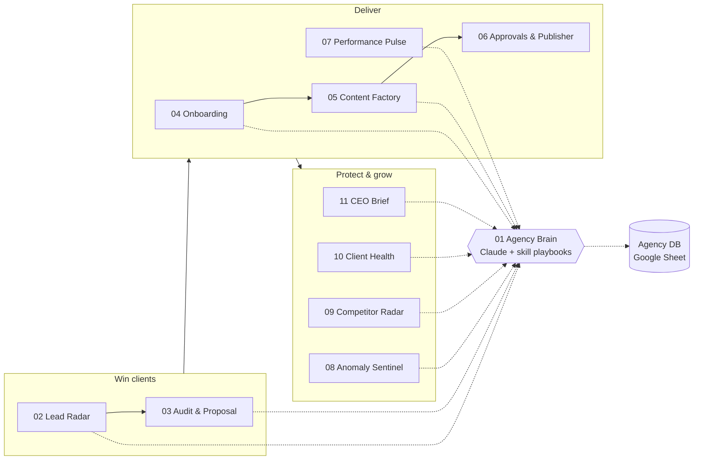

# Agency OS for n8n

Agency OS is a suite of 13 importable n8n workflows that runs a marketing agency's core operations. It covers lead intake, proposals, onboarding, content, client reporting, monitoring, retention, and a weekly CEO brief.

Every AI step goes through one shared sub-workflow, the **Agency Brain**. The Brain loads a skill from this repository (`skills/<name>/SKILL.md`) as Claude's playbook for that job. When a skill improves, every workflow that uses it improves too, with no edits in n8n.

## The workflows

| # | Workflow | Trigger | Brain playbook(s) | What it does |
|---|---|---|---|---|
| 00 | Setup: Create Agency DB | Manual, run once | none | Creates the Google Sheet with all 8 tabs and header rows |
| 01 | Agency Brain | Called by the others | any | Runs Claude with a skill playbook and optional strict JSON output; logs tokens and cost per client to **AI Ledger** |
| 02 | Lead Radar | Webhook + n8n form | `revops` | Normalizes the lead and reads their website and tech stack. Scores fit 0-100, then routes: hot leads get a Slack alert and a personal booking email, warm leads get a nurture email, cold leads are archived |
| 03 | Instant Audit & Proposal | Internal form | `seo-audit`, `cro`, `sales-enablement` | Crawls the homepage, robots.txt and sitemap and computes about 25 technical signals. Then runs an SEO audit and a CRO review and writes a proposal with 3 priced packages and a 90-day plan, emailed to the account manager |
| 04 | Client Onboarding Autopilot | Internal form | `product-marketing`, `marketing-plan` | Creates a Drive folder and Slack channel, writes a positioning doc (saved to Drive) and a 90-day plan, then registers the client and sends a welcome email. Seeds the client's competitors and runs a day-3 access check |
| 05 | Content Factory | Mondays 06:00 | `social` | Drafts next week's posts per client in their brand voice, avoiding hooks already used. Emails the client one-click **Approve / Request changes** links |
| 06 | Approvals & Publisher | Approval links + hourly | none | Verifies each link's secret token, records the decision, and schedules approved posts in Ayrshare. Instagram and TikTok posts without media are flagged for design |
| 07 | Performance Pulse | 1st of month 08:00 | `analytics` | Makes one GA4 batch call (totals, channels, landing pages) and computes month-over-month KPIs in code. Claude writes the story and 3 experiments; the result is emailed as an HTML report |
| 08 | Anomaly Sentinel | Daily 08:15 | `analytics` | Compares yesterday with the same weekday over the past 4 weeks and with a 28-day z-score. Diagnoses traffic, conversion and revenue drops or spikes and tracking outages |
| 09 | Competitor Radar | Wednesdays 07:00 | `competitor-profiling` | Diffs competitor pages sentence by sentence and tracks price points. Classifies each change and suggests counter-moves |
| 10 | Client Health & Churn Predictor | Fridays 16:00 + Gmail listener | `churn-prevention` | Scores each client 0-100 on results, responsiveness, billing and delivery. Tracks when each client last replied from your inbox and writes save plans for watch and at-risk clients |
| 11 | CEO Brief | Mondays 07:30 | `marketing-council` | Summarizes pipeline, MRR, MRR at risk, health and AI spend. The council of advisors agrees on 3 priorities and one bold bet |
| 99 | Error Guardian | Any workflow error | none | Posts the failing workflow, node, error and execution link to `#agency-ops` |

## Setup

These workflows were built and tested on **n8n 2.41**. They use current node versions (Execute Workflow 1.2, Form Trigger 2.2, Google Sheets 4.5), so an older n8n 1.x instance may need upgrading.

### 1. Create credentials in n8n

| Credential | Used by | Notes |
|---|---|---|
| Anthropic | 01 | API key from console.anthropic.com |
| Google Sheets OAuth2 | all | Holds the Agency DB |
| Gmail OAuth2 | 02, 03, 04, 05, 07, 10, 11 | Sends emails; 10 also reads the inbox |
| Google Drive OAuth2 | 04 | Client folders and docs |
| Google Analytics OAuth2 | 07, 08 | GA4 Data API, read-only |
| Slack API | all except 00/01 | Bot scopes: `chat:write`, `channels:read`, `groups:read`, `groups:write`. Invite the bot to your `#agency-*` channels |
| Header Auth (Ayrshare) | 06 | Name `Authorization`, value `Bearer <AYRSHARE_API_KEY>` |

### 2. Import and wire up

1. Import all 13 JSON files: **Workflows → Import from file**.
2. Open **00 Setup**, attach the Sheets credential to both HTTP nodes, and execute it. Copy the `spreadsheet_id` from the last node.
3. Open **01 Agency Brain**. In the **Brain Config** node, set `sheet_id` and `agency_name`. **Publish** the workflow, which n8n 2.x requires before other workflows can call it. Copy its workflow ID from the URL.
4. In every other workflow, open the **Config** node and set `sheet_id`, `brain_workflow_id` and `agency_name`, plus that workflow's own fields (see below).
5. In each workflow's **Settings → Error workflow**, choose **Agency OS 99 · Error Guardian**.
6. Attach credentials to the remaining nodes (n8n flags the missing ones), then publish the workflows you want live.
7. Point your website's contact form at `POST https://<your-n8n>/webhook/agency-lead` with JSON (`name`, `email`, `company`, `website`, `service`, `budget`, `message`). You can also share the n8n form URL from **02**.

### Config fields per workflow

| Workflow | Fields |
|---|---|
| 02 Lead Radar | `min_hot_score` (75), `booking_link`, `nurture_link`, `slack_leads_channel`, `sender_name` |
| 03 Audit & Proposal | `slack_sales_channel` |
| 04 Onboarding | `drive_parent_folder_id`, `kickoff_booking_link`, `slack_ops_channel`, `onboarding_form_link` |
| 05 Content Factory | `webhook_base_url` (your public n8n URL), `posts_per_client`, `post_hour`, `slack_content_channel` |
| 06 Approvals & Publisher | `slack_content_channel`, `schedule_window_hours` |
| 07 Performance Pulse | `slack_reports_channel` |
| 08 Anomaly Sentinel | `slack_alerts_channel`, `threshold_pct` (35), `min_z` (2), `min_baseline_sessions`, `min_baseline_key_events` |
| 09 Competitor Radar | `slack_intel_channel`, `min_changed_sentences` |
| 10 Client Health | `slack_leadership_channel` |
| 11 CEO Brief | `founder_email`, `slack_leadership_channel` |

Schedules and post times use the timezone in **Settings → Timezone** (or your instance's `GENERIC_TIMEZONE`).

## Agency DB (Google Sheet)

Workflow **00** creates these tabs. Columns must keep these exact names, because the workflows map fields by header.

| Tab | Columns |
|---|---|
| Clients | client_id, client_name, status (`active`/`paused`), website, contact_name, contact_email, account_manager_email, services, retainer_usd, start_date, ga4_property_id, slack_channel_id, drive_folder_id, ayrshare_profile_key, brand_voice, audience, goals, competitors, last_client_reply, invoices_overdue, health_score, health_status |
| Leads | created_at, name, email, company, website, service, budget, message, source, score, tier, recommended_service, est_deal_value_usd, fit_summary, buying_signals, risks, next_best_action, personalized_opener |
| Proposals | created_at, company, website, contact_name, contact_email, goal, budget, seo_score, cro_score, recommended_package, proposal_value_usd, status |
| Content | id, token, client_id, client_name, week_of, channel, publish_at, hook, body, cta, hashtags, visual_brief, media_url, status, reviewed_at, ayrshare_id |
| Metrics | month, client_id, client_name, sessions, users, key_events, revenue, engagement_rate, sessions_mom_pct, key_events_mom_pct, revenue_mom_pct, headline |
| Competitors | client_id, competitor_url, last_checked, last_snapshot, last_change_summary |
| Health | week_of, client_id, client_name, score, status, results_pts, responsiveness_pts, billing_pts, delivery_pts, drivers |
| AI Ledger | timestamp, caller, client, skill, model, input_tokens, output_tokens, cache_read_tokens, cache_write_tokens, est_cost_usd, stop_reason, error |

Clients added through **04** are filled in automatically. For existing clients, add rows by hand. `services` drives which workflows apply: include `Social` or `Content` for the Content Factory, and set `ga4_property_id` for reports and anomaly alerts. Keep `invoices_overdue` current, or sync it from your billing tool.

## How the Agency Brain works

- **Playbooks:** the Brain fetches `skills/<skill>/SKILL.md` from GitHub and uses it as the system prompt, together with instructions for running unattended (no clarifying questions, no invented numbers). To pin a version or use your own fork, change `skills_base_url` in **Brain Config**.
- **Model:** `claude-opus-5-5`, with adaptive thinking and a per-task `effort` setting (low, medium or high). Refusals are retried server-side via `fallbacks: "default"`. A refusal, a truncated answer or invalid JSON comes back as `ai_error` instead of crashing the caller.
- **Structured output:** callers pass a JSON schema, and the Brain requests `output_config.format` so Claude's reply is always parseable JSON. Numbers in reports are computed in code; Claude only interprets them.
- **Cost tracking:** every call is written to **AI Ledger** with its tokens and estimated USD. The system prompt is cached, so back-to-back calls that use the same playbook (for example, Content Factory across clients) pay less for input tokens. The CEO Brief reports AI spend as a percentage of MRR.

To add your own AI step anywhere, set `brain = { skill, task, context, schema?, effort? }` on an item and call the Brain with an **Execute Workflow** node. The same item comes back with `ai` added.

**Rough cost:** a typical call costs a few cents on Opus 5.5 ($4 / $20 per million input/output tokens). An agency with 10 clients and about 100 leads a month makes roughly 200–250 Brain calls, which comes to tens of dollars a month. Treat this as an estimate, and check the AI Ledger for your real numbers.

## How this was tested

- **Static checks:** every node's type, version, parameters and option values were checked against the real node definitions in `n8n-nodes-base` 2.41, using n8n's own `getNodeParametersIssues`. The Code nodes were syntax-checked.
- **Import:** all 13 files import cleanly into n8n 2.41.
- **Execution:** 18 scenarios ran end to end in n8n 2.41, covering both triggers of 02, 06 and 10, the approve, change-request, bad-token and publisher paths, and the error path. External services were replaced by fixture nodes that evaluate the original node's expressions and fail on `undefined` output or on sheet columns that don't exist. The Brain ran as a real sub-workflow, with only the Claude HTTP call mocked; that mock validated each request body and JSON schema.
- **Not tested live:** the suite was not run against live Google, Slack, Ayrshare or Anthropic accounts. Do a manual test run of each workflow after you attach credentials.

## Customizing

- **Different stack:** swap the Google Sheets nodes for Airtable, Notion or Postgres, keeping the field names; the Code nodes don't care where rows come from. Swap Ayrshare for Buffer, Metricool or native LinkedIn nodes in **06**.
- **Ads data:** add Google Ads or Meta Ads pulls to **07** and **08** (see `tools/integrations/google-ads.md` and `meta-ads.md`) and pass the extra metrics into the Brain's `context`.
- **Other playbooks:** any skill in `skills/` works. Try `cold-email` for outbound follow-ups, `ab-testing` for test design, or `ad-creative` for weekly ad variations.
